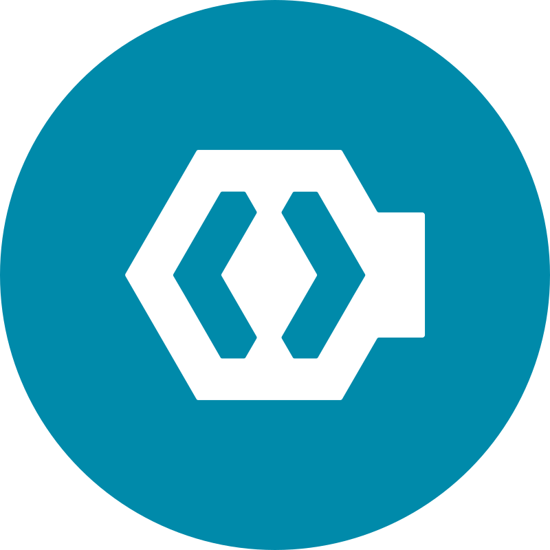
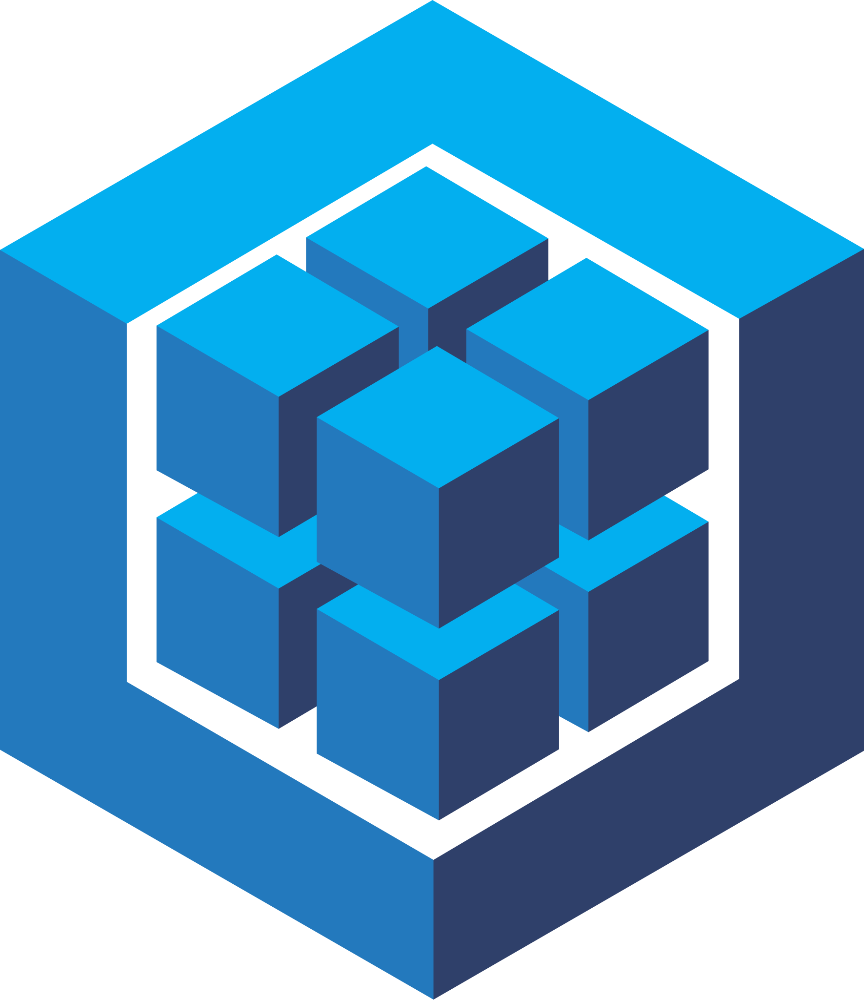
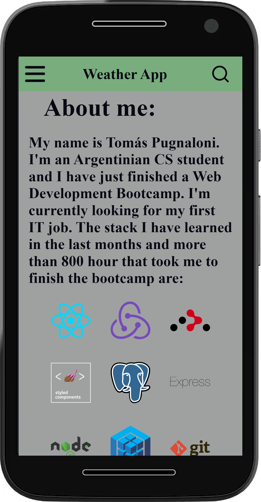

### Hi there! 👋

I am a passionate Developer, that has the desire to sharp his current skills and master the most important programming languages and frameworks. I found in technology a world that inspires me to give my 100%, to learn and believe that every action we take shapes the future.

<h3> Some tecnologies I've learned and enjoy working with:</h3>
HTML&nbsp;&nbsp;&nbsp;|&nbsp;&nbsp;&nbsp;CSS&nbsp;&nbsp;&nbsp;|&nbsp;&nbsp;&nbsp;JavaScript&nbsp;&nbsp;&nbsp;|&nbsp;&nbsp;&nbsp;React
&nbsp;&nbsp;&nbsp;|&nbsp;&nbsp;&nbsp;Redux&nbsp;&nbsp;&nbsp;|&nbsp;&nbsp;&nbsp;Node Js&nbsp;&nbsp;&nbsp;|&nbsp;&nbsp;&nbsp;Express Js
&nbsp;&nbsp;&nbsp;|&nbsp;&nbsp;&nbsp;Sequelize ORM&nbsp;&nbsp;&nbsp;|&nbsp;&nbsp;&nbsp;PostgreSQL

&nbsp;&nbsp;&nbsp;|&nbsp;&nbsp;&nbsp;

&nbsp;&nbsp;&nbsp;|&nbsp;&nbsp;&nbsp;

&nbsp;&nbsp;&nbsp;|&nbsp;&nbsp;&nbsp;

&nbsp;&nbsp;&nbsp;|&nbsp;&nbsp;&nbsp;

&nbsp;&nbsp;&nbsp;|&nbsp;&nbsp;&nbsp;

&nbsp;&nbsp;&nbsp;|&nbsp;&nbsp;&nbsp;

&nbsp;&nbsp;&nbsp;|&nbsp;&nbsp;&nbsp;

&nbsp;&nbsp;&nbsp;|&nbsp;&nbsp;&nbsp;

&nbsp;&nbsp;&nbsp;|&nbsp;&nbsp;&nbsp;

&nbsp;&nbsp;&nbsp;|&nbsp;&nbsp;&nbsp;

&nbsp;&nbsp;&nbsp;|&nbsp;&nbsp;&nbsp;

&nbsp;&nbsp;&nbsp;|&nbsp;&nbsp;&nbsp;

&nbsp;&nbsp;&nbsp;|&nbsp;&nbsp;&nbsp;

&nbsp;&nbsp;&nbsp;|&nbsp;&nbsp;&nbsp;

- 🌱 I’m currently developing my backend skills while learning: Scala | Spark | Java

## My last proyects:
### 🥣 Recetillas con Sabor (Tasty Recipes) 🥣

   It's a SPA(Single Page Application) that retrieves the information from an external API (Spoonacular.com/food-api) and from a local database. The app displays the different recipes and their details.

#### Features: 
- You can search by name and filter by diet type. 
- You can order both by name or score. 
- You can create a new recipe using a controlled form 

#### 🧰 Stack: 🧰 

##### **Front-End:**
-  React
  - Redux
  - Router
- Styled Components

##### **Back-End:**
- NodeJs
- Express
- PostgreSQL
- Sequelize
 
  

  
  
  

  
  
  

### ⛅ Weather App ⛅
   
 I'ts a SPA that retrieves weather information from an external API (openweathermap.org) 

#### Features:
- Responsive
- Dark Theme
- You can search by city
- You can access the city details.
        
#### 🧰 Stack: 🧰
-  React   
-  React Router
-  Styled-Components 

  

  
  
  

  
  

## Feel free to contact me:

<a href="https://www.linkedin.com/in/tomas-pugnaloni"> > Tomas Pugnaloni</a>

<a href="mailto:tomi.pugna@gmail.com"> > tomi.pugna@gmail.com</a>

